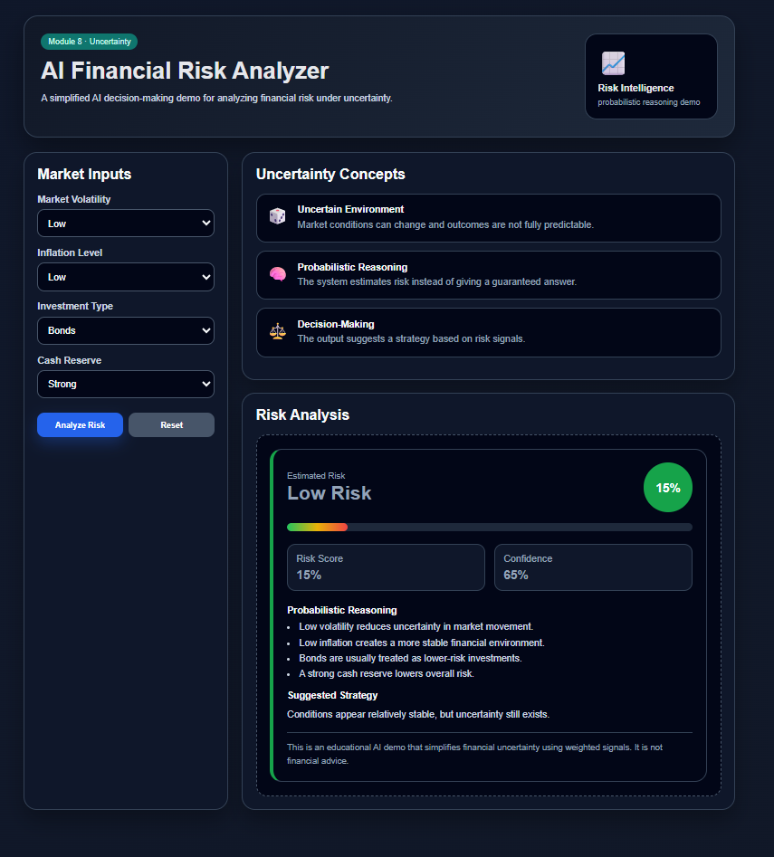
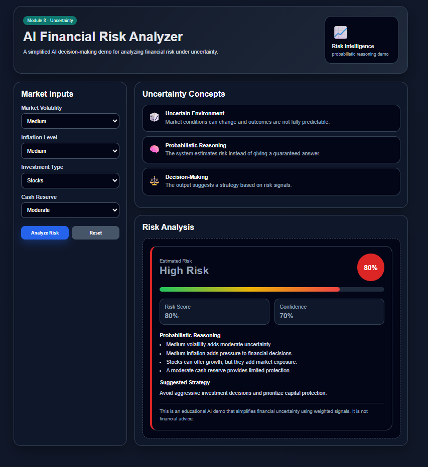
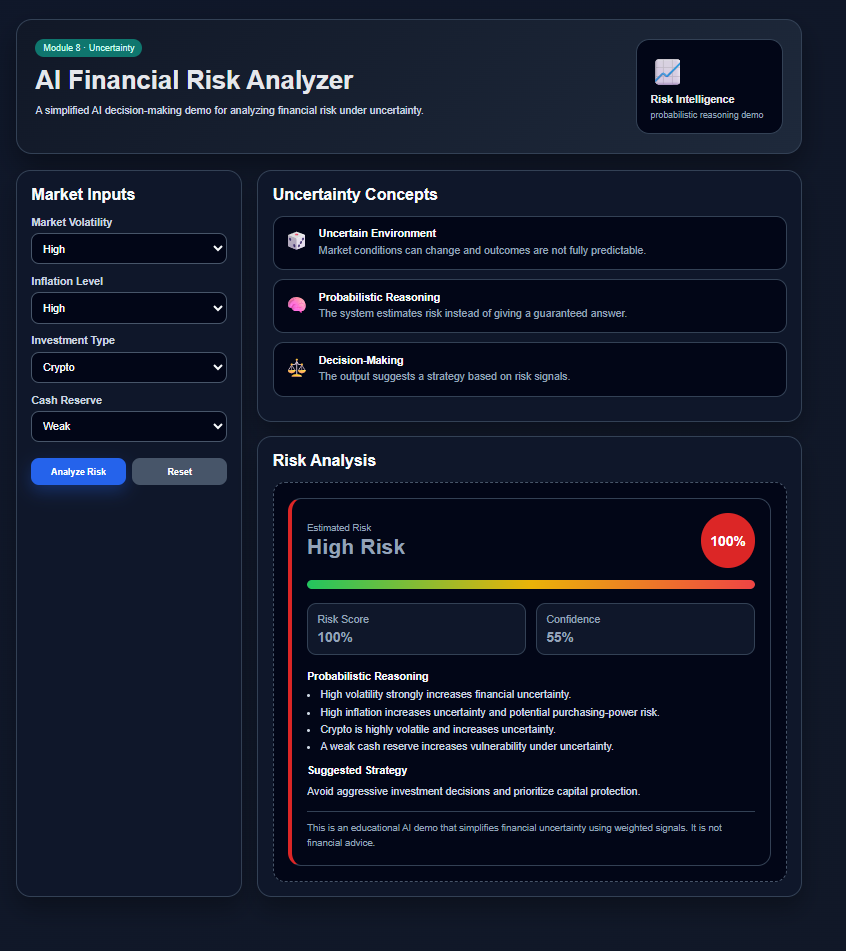

# 📈 AI Financial Risk Analyzer

An interactive AI dashboard that simulates probabilistic financial risk analysis and decision-making under uncertainty.

This project demonstrates how AI systems can evaluate uncertain environments using weighted reasoning and risk estimation.

---

## 🚀 Live Demo

👉 [View the app](PEGÁ_ACÁ_TU_LINK_DE_GITHUB_PAGES)

---

## 📂 Repository

👉 [View source code](https://github.com/devCODEMATE/ai-financial-risk-analyzer)

---

## 🧠 Concepts Applied

- Probabilistic Reasoning
- Decision-Making Under Uncertainty
- Risk Estimation
- AI Scoring Systems
- Financial Signal Analysis

---

## 📊 App Preview

### 🟢 Low Risk Scenario

### 🟡 Medium Risk Scenario

### 🔴 High Risk Scenario

---

## 💡 How It Works

The AI system evaluates multiple uncertain financial signals:

- Market volatility
- Inflation level
- Investment type
- Cash reserve strength

Each variable contributes to an overall probabilistic risk score.

The system then estimates:

- Risk level
- Confidence score
- Suggested strategy

---

## 🎲 Uncertainty & AI Reasoning

This project simulates how AI systems operate in uncertain environments where outcomes are not fully predictable.

Instead of generating exact predictions, the system estimates probabilities and recommends actions based on weighted signals.

---

## ⚠️ Disclaimer

This is an educational AI simulation created for learning purposes only.

It does not provide real financial advice.

---

## 🔮 Future Improvements

- Real-time market data integration
- Dynamic probability adjustment
- Portfolio diversification analysis
- AI forecasting models
- Interactive financial charts

---

Built as part of my journey learning AI concepts through hands-on projects and interactive systems.